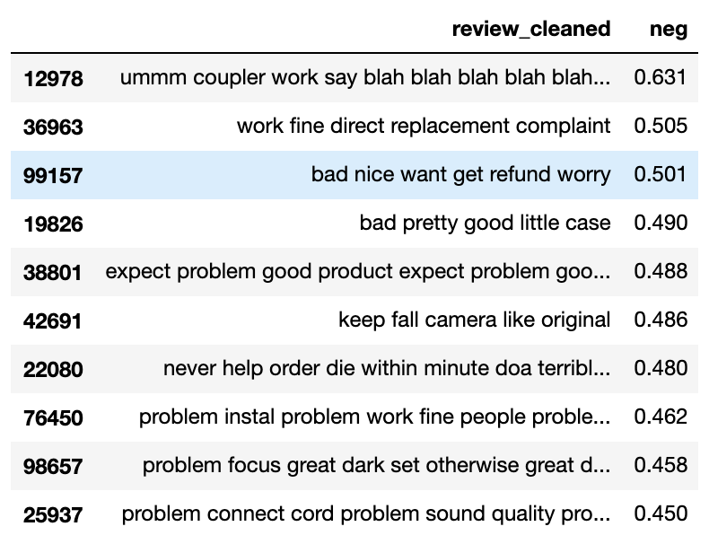

# Amazon Reviews Sentiment Prediction 
This project illustrates techniques to predict the sentiments (Positive, Negative or Neutral) behind customer reviews.  Different models will be used to predict the sentiments of the reviews for electronic products on www.Amazon.com. 

---

## Data
The data consisted on 1.6M reviews for Electronics with its associated ratings between 1 to 5. The data was taken from here: [Amazon Customer reviews](http://jmcauley.ucsd.edu/data/amazon "Dataset for project") 
Only the Electronics Reviews have been used for this project. There are 9 columns in the dataset, only reviews and ratings columns were taken into account. 

As part of creating (training and validating) predictive models, a subset of first 100K reviews were taken out of 1.6M reviews. Remaining 1.5M reviews were reserved as unseen test data. 

The Ratings between 1 and 5 were used to create Sentiment Feature which converts ratings 4 & 5 as Positive, 3 as Neutral and 1 & 3 as negative reviews. 

### Balancing the data

Data of 100K reviews was highly imbalanced. There were 80% positive reviews, 12% negative reviews and 8% neutral reviews. 
In order the balance the data, data was first splitted into train(80%) and test(20%) and training data was balanced using SKlearn resample by undersampling positive reviews and oversampling neutral reviews to be equal to negative reviews. The training data reduced to 30K after balancing.

### Text cleaning
The balanced training data were cleaned with the following proccesses to get words which may better classify the sentiments:  
* Lower the text.

* Tokenize to words, remove punctuations.

* Remove words with numbers.

* Remove Stop words.

* Part of Speech (POS) tagging.

* Lemmatize the text.  

---
## Exploratory Data Analysis

### Sentiments vs Length of the Comments
A relationship between sentiments and length of the comments written by the customers was analyzed. The graph is shown below:  

  

The graph above shows that median length of negative reviews are way more than positive reviews. People tend to write longer if they aren't satistified with the product. 

### Vader Sentiments Analysis
Vader was used to provide sentiment scores to each review. This creates three more features 'pos', 'neg' and 'neu' for positive, negative and neutral scores for each review respectively. 

Below are the top 10 reviews that scored best as positive reviews and associated words: 

Below are the top 10 reviews that scored best as neutral reviews and associated words: 

Below are the top 10 reviews that scored best as negative reviews and associated words: 

Using Vader, intensity of the reviews sentiment was also analyzed as a distribution of 'compound' attribute of Vader which is the sum of scores(pos,neu,neg) and normalized between -1 and 1. 
Below is the graph for the same: 

Good reviews correspond to ratings 3, 4 and 5 whereas bad reviews to 1 and 2. 
As shown in the distribution plot above, good reviews show a high peak and bad reviews have high variance and no peak which tells that: 
>Good reviews are too good and bad reviews are not that bad.

---
## Predictive Modeling

In order to predict the sentiments of the reviews, several Pipelines were created with combination of TfidfVectorizer and different predictive models as listed below: 
* Logistic Regression
* Decision Tree Classifier
* Random Forest Classifier
* Gradient Boosting Classifier
* Naive Bayes

Firstly, models were trained with **balanced and cleaned** training data and tested against testing data.

Accuracy was chosen as the metric for comparing the models as the training data was balanced. Below are the **accuracies** for different models: 
* Logistic Regression: **64.8%**
* Decision Tree Classifier: **48.5%**
* Random Forest Classifier: **68.9%**
* Gradient Boosting Classifier: **58%**
* Naive Bayes: **52.7%**

Here, Logistic Regression and Random Forest were the top two qualifying models.

>However, comments can be more informative without cleaning as punctuations and stop words can change the sentiments and meaning of the reviews.

So, all the models were training with **balanced data only** without any cleaning and tested for accuracy again against testing data. 

New accuracies are:

* Logistic Regression : **72.9%**
* Decision Tree Classifier : **54%**
* Random Forest Classifier : **72.7%**
* Gradient Boosting Classifier : **66.9%**
* Naive Bayes : **61.5%**

Accuraries increased significantly for all the models. Still Logistic Regression and Random Forest and the top two. So these are considered for **Grid Search**.

### Grid Search

Two baseline models were selected to run the grid search for:
* Logistic Regression
* Random Forest

#### Logistic Regression
Several paramenters of Pipeline of TfidfVectorizer and Logistic Regression were used for grid search and are listed below: 
1. Tfidf max_df
1. Tfidf min_df
1. Tfidf ngram_range
1. Logistic Regression C
1. Logistic Regression max_iter

>Best accuracy score of **75.6%** was obtained by Tfidf ngram_range of (3,7), C=1, max_df=1, min_df=1. Previous accuracy was **72.9%**. An **increase** of **2.7%**.

Below is the Reciever Operating Curve for best model of Logistic Regression: 

#### Random Forest

Several paramenters of Pipeline of TfidfVectorizer and Random Forest were used for grid search and are listed below: 
1. Tfidf max_df
1. Tfidf min_df
1. Tfidf ngram_range
1. RF n_estimators
1. RF min_samples_split

>Best accuracy score of **77.8%** was obtained by Tfidf ngram_range of (3,6), max_df=1, min_df=1, n_estimators=200 and min_samples_split=1000. Previous accuracy was **72.7%**. An **increase** of **5.1%**.

## Result

Both Logistic Regression and Random Forest model were tested against 1.5M unseen test data and below are accuracies: 

>Logistic Regression Accuracy: **74%**
Random Forest Accuracy: **76.4**
 
## Conclusion
>For this project, Random Forest is the best model for predicting the sentiments of the reviews.

